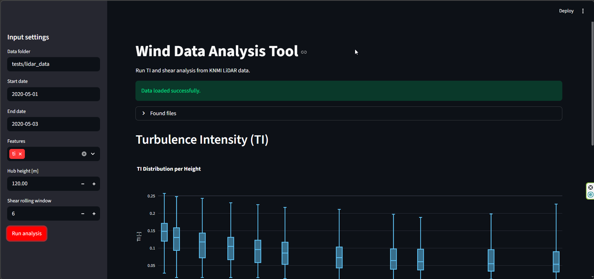
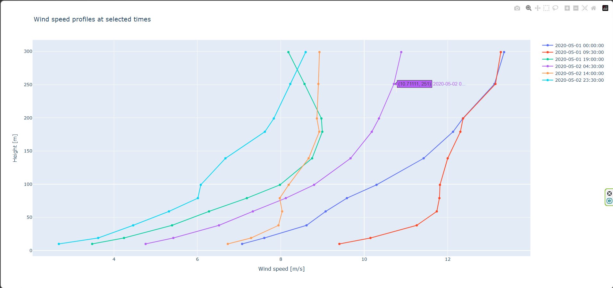

# Wind Data Analysis


`Wind Data Analysis` is a Python tool for analyzing wind measurement data, with a current focus on **LiDAR-based wind data processing** (met-mast support planned for future versions). 

This tool is designed to support wind engineering workflows such as load validation, site assessment, and LiDAR-based analysis.

The package helps you:

- read KNMI LiDAR CSV files,
- filter files by date range,
- compute wind statistics from raw or 10-minute LiDAR data,
- build wind-speed profiles across heights,
- calculate **vertical wind shear**,
- calculate **turbulence intensity (TI)**,
- prepare data for plotting and further analysis.

The repository is organized as a Python package with a `src/` layout and includes tests and example datasets for development and validation.  

## Current status

At the moment, the tool is mainly centered on **KNMI LiDAR workflows**.  
**Please note** that this project is under active development and new features are continuously being added.


## Main features

### 1. Read KNMI LiDAR files
The package can:

- search a folder recursively for KNMI LiDAR CSV files,
- filter files between a start date and end date,
- read the files into pandas DataFrames with a time index.

### 2. Compute LiDAR statistics
The package can detect whether the LiDAR data is:

- **high-frequency** raw data, or
- **low-frequency / 10-minute** data,

and then compute or extract:

- mean wind speed,
- max wind speed,
- min wind speed,
- standard deviation.

### 3. Build wind profiles
The tool can reorganize multi-height wind-speed measurements into profiles, where:

- the index is time,
- the columns are heights,
- the values are wind speeds.

This is useful for shear analysis and profile-based visualization.

### 4. Calculate vertical wind shear
The package includes power-law shear fitting:


`U(z) = U_ref * (z / z_ref)^α`

It estimates:

- the shear exponent `alpha`,
- the standard error of `alpha`,
- rolling median and rolling mean values.

### 5. Calculate turbulence intensity (TI)
The package calculates turbulence intensity using:

`TI = σ / U`

It also supports:

- TI by height,
- TI in wind-speed bins,
- TI with wind-direction context.


## Requirements

- Python 3.10+
- OS: Windows, Linux, or macOS

Main dependencies:

- `numpy`, `pandas`, `scipy`, `xarray`
- `matplotlib`, `seaborn`, `plotly`, `kaleido`
- `streamlit`
- `pytest` (for tests)


## Installation

### 1. Create and activate a virtual environment

Windows (PowerShell or CMD):

```bash
python -m venv .venv
.venv\Scripts\activate
```

Windows (Anaconda Prompt):

```bash
conda create -n wind_analysis python=3.10
conda activate wind_analysis
```

Linux:

```bash
python -m venv .venv
source .venv/bin/activate
```

### 2. Install dependencies and package

```bash
git clone https://github.com/arash7444/wind_data_analysis_public.git
cd wind_data_analysis_public
pip install --upgrade pip
pip install -r requirements.txt
pip install -e .
```

### 3. Test the installation

```bash
pytest tests
```

## Quick Start

Use the JSON config in `input_files/input_config.json` and run:

```bash
python run_wind_analysis.py
```

This script reads `input_files/input_config.json` by default and writes plots to `outputs/`.

## Configuration File

The input JSON controls what analysis runs.

Example (`input_files/input_config.json`):

```json
{
    "data_folder": "tests/lidar_data",
    "start_date": "2020-05-01",
    "end_date": "2020-05-03",
    "features": ["shear", "ti"],
    "hub_height": 120.0,
    "shear_window": 6,
    "show_plot": true,
    "save_dir": "outputs"
}
```


## Usage
### Option A: Main runner (default config path)

```bash
python run_wind_analysis.py
```

Behavior:

- Reads `input_files/input_config.json`
- Supports `ti` and `shear`
- Saves interactive Plotly HTML outputs to `save_dir`

### Option B: Streamlit App

You can explore inputs interactively via Streamlit:

```bash
streamlit run simple_gui.py
```

## Demo

### Streamlit Interface



### Interactive Plot (Plotly)


