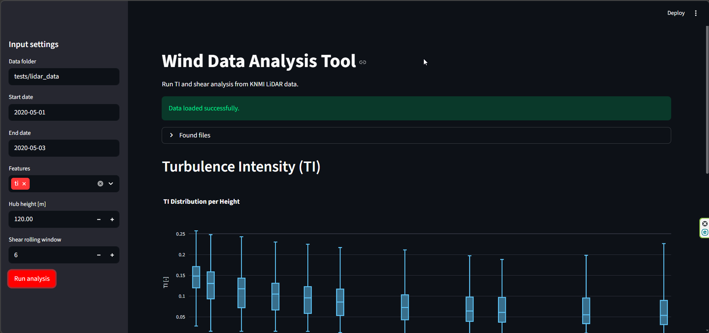
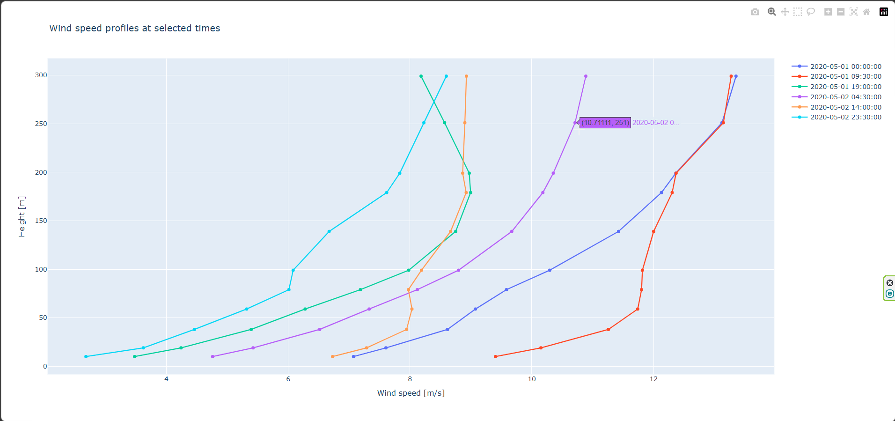

# Wind Data Analysis


`Wind Data Analysis` is a Python tool for LiDAR processing and multi-height
LiDAR-versus-met-mast wind-speed comparison.

This tool is designed to support wind engineering workflows such as load validation, site assessment, and LiDAR-based analysis.

The package helps you:

- read KNMI LiDAR CSV files,
- filter files by date range,
- compute wind statistics from raw or 10-minute LiDAR data,
- build wind-speed profiles across heights,
- calculate **vertical wind shear**,
- calculate **turbulence intensity (TI)**,
- align KNMI met-mast observations with LiDAR 10-minute means,
- compare dynamically selected, nearby measurement-height pairs,
- prepare data for plotting and further analysis.

The repository is organized as a Python package with a `src/` layout and includes tests and example datasets for development and validation.  

## Current status

The tool supports KNMI LiDAR workflows and an optional first-version
LiDAR/met-mast horizontal wind-speed comparison.
**Please note** that this project is under active development and new features are continuously being added.


## Main features

### 1. Read KNMI LiDAR files
The package can:

- search a folder recursively for KNMI LiDAR CSV files,
- filter files between a start date and end date,
- read the files into pandas DataFrames with a time index.

### 2. Compute LiDAR statistics
The package can detect whether the LiDAR data is:

- **high-frequency** raw data, or
- **low-frequency / 10-minute** data,

and then compute or extract:

- mean wind speed,
- max wind speed,
- min wind speed,
- standard deviation.

Horizontal wind speed is valid when it is numeric, finite, and between 0 and
99 m/s inclusive. For raw LiDAR this rule is applied before 10-minute
resampling. The sampling interval is inferred per file from the median positive
timestamp difference, and expected samples per bin use round-half-up on
`600 / interval_seconds`. Bins below the configurable raw-sample coverage
threshold are marked missing; the default threshold is 80%, and equality
passes. Pre-averaged LiDAR receives the same 0--99 m/s bin check, but raw
coverage is unavailable.

### 3. Build wind profiles
The tool can reorganize multi-height wind-speed measurements into profiles, where:

- the index is time,
- the columns are heights,
- the values are wind speeds.

This is useful for shear analysis and profile-based visualization.

### 4. Calculate vertical wind shear
The package includes power-law shear fitting:


`U(z) = U_ref * (z / z_ref)^α`

It estimates:

- the shear exponent `alpha`,
- the standard error of `alpha`,
- rolling median and rolling mean values.

### 5. Calculate turbulence intensity (TI)
The package calculates turbulence intensity using:

`TI = σ / U`

It also supports:

- TI by height,
- TI in wind-speed bins,
- TI with wind-direction context.


## Requirements

- Python 3.10+
- OS: Windows, Linux, or macOS

Main dependencies:

- `numpy`, `pandas`, `scipy`, `xarray`
- `matplotlib`, `seaborn`, `plotly`, `kaleido`
- `streamlit`
- `pytest` (development only, for tests)


## Installation

### 1. Install uv

Windows (PowerShell):

```powershell
powershell -ExecutionPolicy ByPass -c "irm https://astral.sh/uv/install.ps1 | iex"
```

Linux or macOS:

```bash
curl -LsSf https://astral.sh/uv/install.sh | sh
```

The project accepts any already-installed Python 3.10 or newer. `uv` creates and manages the project virtual environment automatically.

### 2. Clone and synchronize the project

```bash
git clone https://github.com/arash7444/wind_data_analysis_public.git
cd wind_data_analysis_public
uv sync --locked --dev
```

### 3. Test the installation

```bash
uv run --locked pytest tests
```

## Quick Start

Use the JSON config in `input_files/input_config.json` and run:

```bash
uv run python run_wind_analysis.py
```

This script reads `input_files/input_config.json` by default and writes plots to `outputs/`.

## Configuration File

The input JSON controls what analysis runs.

Example (`input_files/input_config.json`):

```json
{
    "data_folder_lidar": "tests/lidar_data",
    "start_date_lidar": "2020-05-01",
    "end_date_lidar": "2020-05-03",
    "features": ["shear", "ti"],
    "hub_height": 120.0,
    "shear_window": 6,
    "show_plot": true,
    "save_dir": "outputs"
}
```


## Usage
### Option A: Main runner (default config path)

```bash
uv run python run_wind_analysis.py
```

Behavior:

- Reads `input_files/input_config.json`
- Supports `ti` and `shear`
- Saves interactive Plotly HTML outputs to `save_dir`

### Option B: Streamlit App

You can explore inputs interactively via Streamlit:

```bash
uv run streamlit run simple_gui.py
```

## Polar plots and wind statistics

The runner and `simple_gui.py` now support two additional feature choices:

- `ti_polar`: TI by wind direction and reference wind-speed bin at selected heights.
- `stats`: mean, maximum, minimum and standard deviation of wind speed over time.

Try all features with the bundled LiDAR data, from the repository root:

```bash
uv run python run_wind_analysis.py input_files/input_config_extended.json
```

This saves interactive HTML plots in `outputs/extended/`, including
`TI_polar_by_height.html` and `stats_139m.html`. Open them in a browser.
The example uses `show_plot: false`, so no browser windows open automatically.
Running `uv run python run_wind_analysis.py` still uses the original configuration.

Add the feature names to your JSON `features` list and set these options:

| Setting | Meaning | Default when omitted |
|---|---|---|
| `stats_height` | Requested height for the four statistics; the nearest common measured height is reported in the plot and output filename | `hub_height` |
| `polar_heights` | List of exact measured heights, such as `[19, 59, 139, 199]`; unavailable heights produce an error | All heights with valid binned TI data |
| `polar_stat` | `median` or `mean` TI within each speed/direction bin | `median` |
| `polar_ncols` | Positive integer giving the number of polar subplot columns | `2` |

Polar angle is wind direction at each plotted height, with north at the top
and angles increasing clockwise. Radius is the centre of the **reference-height
wind-speed bin**, in m/s; it is not necessarily the wind speed at the plotted
height. `calc_ti` selects the nearest available reference height to `hub_height`.
Colour represents dimensionless TI with a shared scale across panels. Empty
bins are omitted. The existing speed bins cover 0–30 m/s and direction bins
now cover the full 0–360° range.

In Streamlit, select `stats` and/or `ti_polar` under **Features**. Additional
controls appear in the sidebar. Polar heights are entered as comma-separated
numbers; leave the field blank to plot all available heights.

For Python use, both plotting functions return figures without displaying them:

```python
from wind_data_analysis.plotting import plot_ti_polar_by_height

# ti_values comes from calc_ti(...).
fig = plot_ti_polar_by_height(ti_values.ti_raw, heights=[19, 139])
fig.show()  # Or fig.write_html("ti_polar.html")
```

## LiDAR and met-mast comparison

The runner and Streamlit app can compare 10-minute mean horizontal wind speed
from KNMI LiDAR CSV and met-mast NetCDF data. The package discovers the heights
present in each input; production code does not contain Cabauw-specific height
lists. It then selects a deterministic one-to-one matching that first maximizes
the number of pairs within `max_height_difference_m`, then minimizes their total
absolute height difference. Exact ties prefer lower height pairs. The default
maximum difference is 2 m, and unpaired heights are reported.

Near-height pairs are not treated as identical heights. Tables and plots always
retain both actual heights and their difference. No vertical interpolation,
extrapolation, calibration, regression correction, direction comparison, shear
comparison, or turbulence-intensity comparison is applied.

Run the bundled one-day comparison with:

```bash
uv run python run_wind_analysis.py input_files/input_config_metmast_comparison.json
```

The flat JSON configuration is:

```json
{
  "data_folder_lidar": "tests/lidar_data",
  "start_date_lidar": "2020-06-07",
  "end_date_lidar": "2020-06-08",
  "min_lidar_raw_coverage_percent": 80.0,
  "data_folder_Metmast": "tests/metmast_data/cesar_tower_meteo_lb1_t10_v1.2_202006.nc",
  "start_date_Metmast": "2020-06-07",
  "end_date_Metmast": "2020-06-08",
  "features": ["metmast_comparison"],
  "max_height_difference_m": 2.0,
  "timestamp_tolerance_seconds": 30.0,
  "show_plot": false,
  "save_dir": "outputs/metmast_comparison"
}
```

LiDAR and met-mast inputs are independent. Each folder is required only when a
selected feature uses that instrument, and every date bound may be omitted:

| Setting | Meaning |
|---|---|
| `data_folder_lidar` | LiDAR CSV file or folder |
| `start_date_lidar`, `end_date_lidar` | Optional inclusive start and exclusive end for LiDAR |
| `min_lidar_raw_coverage_percent` | Minimum valid raw LiDAR sample coverage per 10-minute bin; finite 0--100, default `80.0` |
| `data_folder_Metmast` | Met-mast NetCDF file or folder |
| `start_date_Metmast`, `end_date_Metmast` | Optional inclusive start and exclusive end for met-mast data |

Legacy LiDAR-only `data_folder`, `start_date`, and `end_date` keys remain
accepted, but new configurations should use the instrument-specific names.

Both folder settings accept a single file or a folder. Each instrument's start
is inclusive and end is exclusive, and all four date fields are optional. When
both instruments are compared, only the overlap of their configured or
data-derived periods is used. A missing overlap produces a clear error.
`timestamp_tolerance_seconds` defaults to 30 seconds.

NetCDF floating-time offsets are normalized to the nearest 10-minute grid only
when they are within that tolerance. Larger offsets raise an error instead of
being hidden. Indexes are sorted, and duplicate timestamps found after
normalization are reported as errors. Alignment is an exact inner join on the
validated grid; it is not a broad nearest-time merge or a full-interval shift.
Wind speeds outside the shared numeric, finite, inclusive 0--99 m/s validity
rule are excluded independently for each height pair. The output reports
invalid LiDAR bins, invalid mast bins, and the unique union of excluded paired
bins. Negative values, sentinel values above 99, and non-finite values cannot
enter comparison metrics.

Metrics are calculated separately for every successful pair:

| Metric | Definition and units |
|---|---|
| LiDAR mean | Mean matched LiDAR wind speed, m/s |
| Met-mast mean | Mean matched mast wind speed, m/s |
| Bias | Mean of `LiDAR − met mast`, m/s; positive means LiDAR is higher |
| MAE | Mean absolute LiDAR/met-mast error, m/s |
| RMSE | Root mean squared LiDAR/met-mast error, m/s |
| Pearson correlation | Linear association, dimensionless; missing when data are insufficient or constant |
| Paired-bin availability (`availability_percent`) | Valid paired 10-minute bins divided by scheduled 10-minute periods in the LiDAR/met-mast overlap, percent |
| Raw LiDAR coverage | Valid raw samples divided by inferred expected samples per bin, percent; reported separately from paired-bin availability |

The metrics and pairing report also include source counts, timestamps shared
before validity filtering, final matched count, actual instrument heights,
three invalid-bin counts, raw invalid LiDAR sample counts, mean/minimum raw
coverage, and below-threshold bin counts. Matched CSV rows include raw coverage
and raw-invalid counts when raw LiDAR metadata is available.
Correlation describes association, not agreement.

Wind-direction quality control and LiDAR--mast direction comparison remain a
separate follow-up. That work requires an explicit policy for circular
10-minute averaging near 0/360 degrees, sentinel handling, and direction
coverage; this change does not alter wind direction or negative shear.

The runner writes these files under `save_dir`:

- `metmast_matched_data.csv` (including normalized and original source times);
- `metmast_metrics.csv` and `metmast_height_pairs.csv`;
- `metmast_timeseries.html`, `metmast_scatter.html`,
  `metmast_difference.html`, and `metmast_summary.html`.

In Streamlit, select `metmast_comparison`, enter a NetCDF file/folder, and set
the maximum height difference. The app displays discovered and unmatched
heights, pair diagnostics, metrics, and the same reusable plots.

### Met-mast data by itself

Use the `metmast_data` feature without any LiDAR input to load, summarize, and
export tidy met-mast observations:

```bash
uv run python run_wind_analysis.py input_files/input_config_metmast_data.json
```

The example writes `outputs/metmast_data/metmast_data.csv` and prints the
selected files, period, total rows, source rows per height, valid wind-speed
counts, and mean wind speed. Its configuration is:

```json
{
  "data_folder_Metmast": "tests/metmast_data/cesar_tower_meteo_lb1_t10_v1.2_202006.nc",
  "start_date_Metmast": "2020-06-07",
  "end_date_Metmast": "2020-06-08",
  "features": ["metmast_data"],
  "show_plot": false,
  "save_dir": "outputs/metmast_data"
}
```

Remove either or both date fields to use an open-ended or fully unbounded
period. In Streamlit, `metmast_data` displays the same summary and provides a
tidy CSV download.

For direct Python use:

```python
from wind_data_analysis.data_reader import met_finder, read_met

files = met_finder("path/to/metmast", "2020-05-15", "2020-06-01")
frames = [read_met(path, "2020-05-15", "2020-06-01") for path in files]
```

Date bounds include the start and exclude the end. Monthly files overlapping
the requested period are included, then `read_met` filters the actual measurement
times. The reader expects `z`, `F`, `SF`, `D` and `time`; it also reads `SD`, `TA`
and `Q` when present. Missing optional weather values do not discard valid wind
measurements. Values retain their input units; no quality-flag filtering is
applied. Some NetCDF formats may require an additional xarray backend such as
`netCDF4` installed in your environment.

The comparison intentionally preserves input wind-speed values and applies no
additional quality filtering. Users must review source units, instrument flags,
and suitability for engineering decisions.

## Demo

### Streamlit Interface



### Interactive Plot (Plotly)


